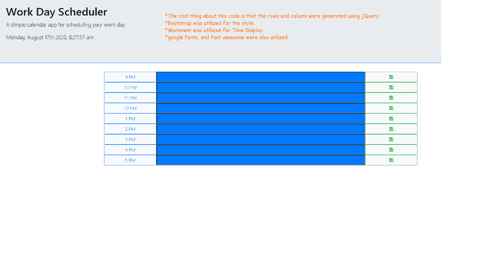

<h1>Simple Work Day Scheduler</h1>

View the website <a href = "https://joejoe909.github.io/Work-Day-Scheduler/">Here</a>

<h2> This is a simple workday scheduler made with HTML, CSS, Javascript and jQuery. In additon the google fonts (Rajdani, sans-serif), the font awesome save icon("far fa-save"), and bootstrap classes were utilized in building this project. </h2>

<h3> Simply enter your text in a time slot and don't forget to click save. Work Day Scheduler utilizes local storage to recall and save your text" </h2>

